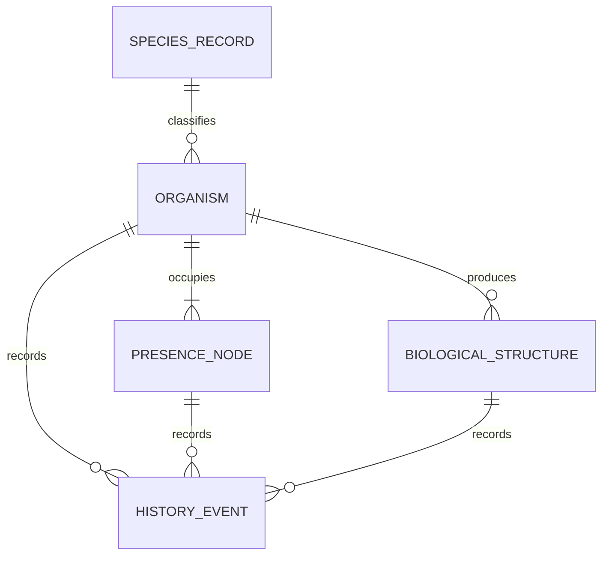

# Terroir Simulator — Ecological Entity Registry v0.1

**Status:** Proposed design artifact
**Scenario:** Driftless-inspired meadow-to-woods edge
**Related artifact:** *Ecological Species Records v0.1*
**Scope:** Stable identity, spatial lookup, colonies, hidden fungal patches, temporary biological structures, and append-only history

## 1. Purpose

This document defines how living organisms and their visible or hidden structures fit into the world registry.

The design must support four requirements:

1. Every meaningful simulated organism has a stable identity.
2. Organisms can be found efficiently by coordinate.
3. Colonies and fungal patches may occupy multiple cells without becoming unrelated organisms.
4. Nothing is erased merely because it dies, collapses, becomes dormant, moves out of the active index, or stops rendering.

The registry represents simulation truth. The renderer, inspector, and future persistence layer read that truth but do not determine it.

## 2. Decision summary

Terroir Simulator will distinguish five concepts:

| Concept              |                          Stable identity | Purpose                                                                                 |
| -------------------- | ---------------------------------------: | --------------------------------------------------------------------------------------- |
| Species record       |                              `SpeciesId` | Immutable catalog definition shared by organisms                                        |
| Organism             |                             `OrganismId` | Persistent biological identity, such as a bellwort clump, sedge colony, or fungal patch |
| Presence node        |                         `PresenceNodeId` | One persistent piece of an organism's spatial presence                                  |
| Biological structure | `StructureId` when independently tracked | A structure with its own position, lifecycle, interaction, or inspection needs          |
| History event        |                                `EventId` | Append-only record of a meaningful change                                               |

The principal rules are:

* IDs are opaque and never derived from coordinates, names, species, or lifecycle state.
* Coordinates are mutable attributes and lookup keys, not identity.
* One organism may own many presence nodes.
* One organism may produce zero or more biological structures.
* A structure receives a stable ID only when it needs independent state or history.
* Current-world indexes may omit inactive items, but authoritative records and history remain queryable.
* The first implementation may store current state plus an append-only journal. Full event sourcing is not required.

## 3. Domain model



### 3.1 Species record

A species record is immutable reference data such as `flora.pennsylvania_sedge`. It describes ecological preferences, lifecycle vocabulary, and visual mappings.

It is not a world object and has no coordinate.

### 3.2 Organism

An organism is the stable biological subject whose continuity matters.

Examples:

* one Pennsylvania sedge colony,
* one large-flowered bellwort clump,
* one unresolved eastern morel fungal patch.

Minimum fields:

| Field             | Meaning                                                              |
| ----------------- | -------------------------------------------------------------------- |
| `organism_id`     | Stable opaque identity                                               |
| `species_id`      | Catalog record used to interpret the organism                        |
| `established_at`  | Simulation time when the organism entered the recorded world         |
| `lifecycle_state` | Current organism-level domain state                                  |
| `activity_status` | Whether it participates in current simulation updates                |
| `ended_at`        | Optional time its biological continuity ended; not a deletion marker |
| `metadata`        | Explicit, versionable scenario or provenance data                    |

`ended_at` does not remove the organism. It records that the organism's continuity is considered complete.

### 3.3 Presence node

A presence node represents one spatially addressable portion of an organism.

It solves a specific problem: a colony or hidden fungal patch can occupy several cells while retaining one organism identity.

Minimum fields:

| Field              | Meaning                                                |
| ------------------ | ------------------------------------------------------ |
| `presence_node_id` | Stable identity for this spatial portion               |
| `organism_id`      | Owning organism                                        |
| `position`         | Current grid coordinate                                |
| `presence_kind`    | `aboveground`, `subsurface`, or another explicit kind  |
| `occupancy_status` | Whether the node belongs in current coordinate lookups |
| `visibility`       | Whether ordinary presentation may reveal it            |
| `established_at`   | Time this portion was created                          |
| `ended_at`         | Optional time this spatial presence ended              |

A node is not automatically a genetic individual, stem, blade, or mushroom. It is a simulation-scale spatial unit.

For v0.1:

* each bellwort clump has one aboveground presence node;
* each sedge colony has one or more aboveground presence nodes;
* each morel fungal patch has one or more hidden subsurface presence nodes.

### 3.4 Biological structure

A biological structure is produced by or attached to an organism but does not automatically define a new organism.

Examples include:

* a morel fruiting cluster,
* a future fruit or seed head that can be inspected or consumed independently,
* a future fallen branch still linked to its source organism.

Minimum fields:

| Field                | Meaning                                            |
| -------------------- | -------------------------------------------------- |
| `structure_id`       | Stable identity                                    |
| `organism_id`        | Organism that produced or owns the structure       |
| `structure_type`     | Domain type, such as `fruiting_cluster`            |
| `position`           | Grid coordinate when spatially present             |
| `lifecycle_state`    | Structure-specific state                           |
| `visibility`         | Current presentation visibility                    |
| `interaction_status` | Whether it can currently be selected or acted upon |
| `emerged_at`         | Time the structure became a tracked structure      |
| `ended_at`           | Optional time its active presence ended            |

When a structure becomes `absent`, it leaves active spatial and rendering indexes. Its record, parent link, and history remain.

## 4. When a structure deserves its own ID

Do not assign an entity ID to every visible detail. Promote a detail to a tracked structure when at least one of these is true:

* it has a lifecycle independent of the parent organism;
* it occupies or moves through space independently;
* it can be selected, consumed, harvested, damaged, or otherwise acted upon independently;
* it can exist in multiple simultaneous instances;
* its individual history is useful to the simulator's query purpose.

If none apply, the detail remains aggregate organism state or sprite variation.

### v0.1 decisions

| Detail                                 |          Separate ID? | Reason                                                          |
| -------------------------------------- | --------------------: | --------------------------------------------------------------- |
| Individual sedge blade                 |                    No | Pure visual detail at current simulation scale                  |
| Sedge presence in a new cell           | Yes, `PresenceNodeId` | Spatial expansion must be queryable                             |
| Bellwort stem                          |                    No | Part of the clump's aggregate visual state                      |
| Bellwort flower or capsule             |                    No | Not independently interactive in v0.1                           |
| Morel fruiting cluster                 |    Yes, `StructureId` | Separate position, lifecycle, visibility, and inspector history |
| Individual mushroom within one cluster |                    No | Cluster is the chosen simulation unit                           |

This rule prevents both extremes: losing meaningful data and turning every pixel into an object.

## 5. Registry responsibilities

The world registry is authoritative for identity and current state. Secondary indexes make common queries efficient.

### 5.1 Authoritative collections

Conceptually, the registry owns:

```text
organisms_by_id: OrganismId → Organism
presence_nodes_by_id: PresenceNodeId → PresenceNode
structures_by_id: StructureId → BiologicalStructure
events_by_id: EventId → HistoryEvent
```

These collections do not use coordinates as keys and do not silently discard ended records.

### 5.2 Derived current-world indexes

The registry maintains rebuildable indexes:

```text
active_presence_by_position: Position → set[PresenceNodeId]
active_structures_by_position: Position → set[StructureId]
organisms_by_species: SpeciesId → set[OrganismId]
presence_nodes_by_organism: OrganismId → set[PresenceNodeId]
structures_by_organism: OrganismId → set[StructureId]
```

The position indexes return sets rather than single values because several non-exclusive things may share a cell:

* subsurface fungal presence,
* aboveground sedge,
* a fruiting cluster,
* leaf litter,
* and a non-organism world feature.

Collision, visibility, and selection rules decide which occupants matter to a particular caller.

### 5.3 Required lookup behavior

The registry should support behavior equivalent to:

| Query                               | Result                                                                |
| ----------------------------------- | --------------------------------------------------------------------- |
| `get_organism(OrganismId)`          | One authoritative organism record                                     |
| `get_presence_node(PresenceNodeId)` | One authoritative spatial node                                        |
| `get_structure(StructureId)`        | One authoritative biological structure                                |
| `organisms_at(Position)`            | Distinct organisms with active presence or structures at a coordinate |
| `presence_at(Position, filters)`    | Current presence nodes matching visibility/kind filters               |
| `structures_at(Position, filters)`  | Current structures matching type/state filters                        |
| `presence_for(OrganismId)`          | All current or historical nodes owned by an organism                  |
| `structures_for(OrganismId)`        | All current or historical structures owned by an organism             |
| `history_for(id)`                   | Chronological events for an organism, node, or structure              |

Coordinate methods are lookups over the index. They never manufacture or redefine identity.

## 6. Lifecycle and retention

### 6.1 No public destructive removal

The domain API should not expose general-purpose `delete_organism`, `delete_node`, or `delete_structure` operations.

Lifecycle methods express what actually happened:

* `end_organism(...)`
* `end_presence(...)`
* `mark_structure_absent(...)`
* `deactivate(...)`
* `reactivate(...)`

The operation:

1. validates the requested transition;
2. changes current state;
3. updates derived active indexes;
4. appends a history event.

It does not erase the record.

### 6.2 Current state and history

v0.1 does not require full event sourcing. It may keep:

* a mutable current-state record for fast simulation, and
* an append-only event journal for durable history.

Every state-changing domain operation must update both as one logical transaction. When SQLite is introduced later, the same boundary should become a database transaction.

History events minimally contain:

| Field            | Meaning                                             |
| ---------------- | --------------------------------------------------- |
| `event_id`       | Stable event identity                               |
| `occurred_at`    | Simulation time                                     |
| `event_type`     | Domain event vocabulary                             |
| `subject_type`   | Organism, presence node, or structure               |
| `subject_id`     | Stable subject identity                             |
| `organism_id`    | Owning organism for convenient querying             |
| `previous_state` | State before the transition when applicable         |
| `new_state`      | State after the transition when applicable          |
| `position`       | Relevant coordinate when applicable                 |
| `cause`          | Explicit known cause or `unknown`; never fabricated |

Event payloads should be immutable after append. Corrections are new events, not silent rewrites.

## 7. Three-organism proof

### 7.1 Pennsylvania sedge

One sedge colony receives one `OrganismId`.

Its initial tuft receives one `PresenceNodeId`. When rhizomatous growth establishes in an adjacent cell:

1. create a new presence node with a new stable ID;
2. link it to the existing colony;
3. add it to the active coordinate index;
4. append `presence_node_established`.

If shoots later disappear from one cell, end or deactivate that node. Do not end the whole colony if other nodes remain active.

The sprite renderer may group neighboring active nodes visually, but this grouping does not merge or split identities.

### 7.2 Large-flowered bellwort

One bellwort clump receives one `OrganismId` and one aboveground `PresenceNodeId`.

Emergence, flowering, fruiting, posture, stress, senescence, and dormancy are organism state and history events. Individual stems, flowers, and capsules do not receive IDs in v0.1.

During dormancy:

* the organism remains active or seasonally inactive according to simulation rules;
* its aboveground node may become non-visible;
* coordinate lookup can still reveal dormant biological presence when the caller requests it;
* the ordinary renderer shows no aboveground sprite.

### 7.3 Morel

One hidden fungal patch receives one `OrganismId` and several subsurface `PresenceNodeId` values.

The nodes:

* occupy the patch's modeled cells;
* are excluded from ordinary visible-presence queries;
* appear in ecological or debug overlays only when explicitly requested.

When fruiting occurs:

1. choose an eligible coordinate already associated with the patch;
2. create a `BiologicalStructure` with a new `StructureId`;
3. set `structure_type = fruiting_cluster`;
4. link it to the fungal `OrganismId`;
5. append `fruiting_cluster_emerged`;
6. add it to active structure and rendering indexes.

The cluster then progresses through:

```text
emerging → fresh → mature → aging → collapsed → absent
```

At `absent`, it leaves the active coordinate and rendering indexes. The `StructureId`, every lifecycle event, and the fungal parent remain queryable.

A later fruiting at the same coordinate receives a new `StructureId`. Reusing the prior ID would falsely imply that the same temporary structure returned.

## 8. Invariants

The implementation must enforce:

1. Every organism references an existing `SpeciesId`.
2. Every presence node has exactly one owning `OrganismId`.
3. Every biological structure has exactly one owning `OrganismId`.
4. Child records cannot silently change owners.
5. An active position index never references a missing or ended record.
6. An inactive or ended record may be absent from active indexes but remains available by ID.
7. The same ID is never reused, even after its subject ends.
8. A coordinate change, name change, state change, or taxonomic rename never changes identity.
9. A hidden presence node is not returned by an ordinary visible-world query.
10. Every accepted lifecycle transition appends a corresponding history event.
11. Failed transitions change neither current state nor history.
12. Rebuilding all derived indexes from authoritative records produces the same lookup results.

## 9. Acceptance scenarios

### Scenario A — Colony expansion and local loss

* Establish one sedge colony in cell `(2, 2)`.
* Expand it into `(2, 3)` and `(3, 2)`.
* Verify all three nodes share one `OrganismId` and have distinct node IDs.
* End aboveground presence at `(2, 2)`.
* Verify current lookup no longer returns that active node.
* Verify the organism, ended node, original coordinate, and event history remain queryable.

### Scenario B — Dormant plant

* Establish one bellwort clump.
* Progress it through flowering, fruiting, senescence, and dormancy.
* Verify it disappears from ordinary rendering without losing its identity.
* Verify an inspector requesting dormant biological presence can still find it.
* Verify all transitions appear chronologically in history.

### Scenario C — Repeated morel fruiting

* Seed one hidden fungal patch across several cells.
* Create and age one fruiting cluster to `absent`.
* Create another cluster in the same cell during a later eligible period.
* Verify the clusters have different `StructureId` values.
* Verify both link to the same fungal `OrganismId`.
* Verify ordinary rendering shows only the currently visible cluster.
* Verify a history query returns both fruiting episodes.

### Scenario D — Overlapping ecology

* Place hidden morel presence, sedge presence, leaf litter, and a visible fruiting cluster in one cell.
* Verify each domain-specific query returns the correct subset.
* Verify no object overwrites another merely because their coordinates match.

## 10. Implementation boundary

The first implementation should include:

* opaque value objects for `OrganismId`, `PresenceNodeId`, `StructureId`, and `EventId`;
* organism, presence-node, structure, and history-event domain records;
* authoritative ID-keyed registries;
* rebuildable coordinate and ownership indexes;
* lifecycle methods that update state, index membership, and history together;
* the four acceptance scenarios as automated tests.

It should not yet include:

* SQLite persistence;
* full event sourcing or replay as the only source of state;
* continuous root, rhizome, or mycelial geometry;
* genetic-individual modeling;
* automatic merging or splitting of colonies;
* an ID for every stem, leaf, blade, flower, capsule, or mushroom;
* rendering or sprite-selection logic inside the registry.

## 11. Follow-on decisions

After this contract is accepted:

1. align names with the repository's existing world and plant types;
2. define the shared lifecycle vocabulary as code-facing enums or value objects;
3. decide which current state transitions are legal for each organism type;
4. implement the registry foundation and acceptance scenarios;
5. begin strict 32×32 silhouette tests using authoritative world state.

The eventual persistence model can map this contract cleanly into SQLite tables without making SQLite part of the domain model.
